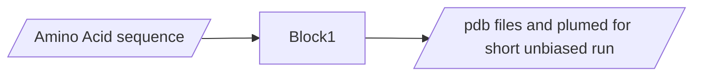

# AF2RAVE-toolset (work in progress)

This repo consists AF2RAVE toolset in colab form

## AF2RAVE - Block1 can be found here --> [Colab link](https://colab.research.google.com/github/Akash-Aranganathan/AF2RAVE-toolset/blob/main/AF2_RAVE_Block1.ipynb)

